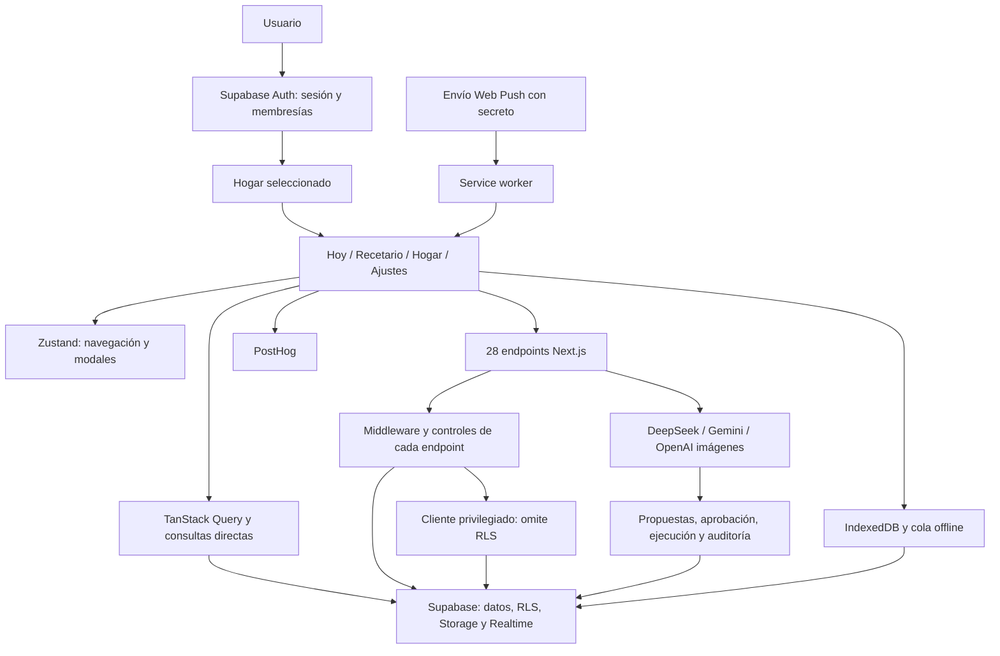

# Auditoría integral del Recetario

Fecha: 4 de septiembre de 2026, hora de Colombia. Código local de `recetario-app`.

## Dictamen

La aplicación tiene una base funcional amplia: recetas, dietas, menús, compras, inventario, tareas domésticas, modo empleado e IA. Compila y sus pruebas existentes pasan. Su problema principal es que varias funciones crecieron con modelos y recorridos distintos: no siempre comparten hogar, menú, estado de guardado ni mecanismo de ejecución.

**Prioridad recomendada: cerrar el aislamiento entre hogares y unificar el recorrido “planear → comprar → cocinar → completar”.** Después, consolidar las acciones de IA, la experiencia sin conexión y el ingreso de nuevos usuarios. La renovación visual debe apoyarse en esos recorridos ya coherentes.

No considero esta versión lista para ampliar su uso a múltiples familias sin corregir los hallazgos de autorización. Esto es una conclusión sobre el código auditado, no una afirmación de que se haya producido una intrusión.

## Alcance y evidencia

Se inventariaron las **9 páginas**, los **28 endpoints de API**, las **4 secciones principales y 5 pestañas del recetario**, **118 archivos de componentes TSX** —incluidos archivos de pruebas—, **38 migraciones**, **19 skills distintos**, sus **4 enlaces compartidos**, **15 perfiles de agentes** y **11 comandos de desarrollo**.

La revisión combina lectura de código, seguimiento de llamadas, comparación entre contratos, compilación, pruebas, cobertura, revisión de dependencias y navegación pública en Chrome con vista móvil de 390 × 844. No equivale a una prueba funcional autenticada de cada botón ni a una certificación de producción.

| Comprobación realizada | Resultado | Límite de lo comprobado |
|---|---|---|
| Compilación de producción | Correcta, incluido TypeScript | Advierte raíz de workspace ambigua y convención middleware deprecada |
| Lint | 0 errores, 174 advertencias | Principalmente elementos sin uso |
| Pruebas | 30 archivos; 430 correctas, 8 omitidas | Muchas integraciones usan dobles de prueba |
| Cobertura | Líneas 15,41%; sentencias 15,29%; ramas 14,05%; funciones 14,89% | Mide `src/lib` y `src/app/api`, no toda la interfaz |
| Navegación pública móvil | Login, registro, recuperación, reset, invitación, onboarding y offline cargan; `/` redirige al login | Sin sesión autenticada; no se enviaron correos ni formularios reales |
| Errores y ancho en esas pantallas | Sin errores de JavaScript ni desbordamiento horizontal con service worker habilitado | No mide accesibilidad completa ni todos los tamaños |
| API sin sesión | 23 endpoints protegidos devuelven 401 incluso con `x-user-id` proporcionado por el cliente | Un método por endpoint; no prueba aislamiento después del login |
| Base conectada: lectura anónima | 29 recursos consultados por HEAD devuelven 401; clave válida comprobada; `households` devuelve `42501 permission denied` | No se descargaron filas privadas ni se probaron escrituras o roles autenticados |
| Ejecutor de propuestas con dependencias simuladas | Reproduce acción con error marcada como exitosa | Ejecuta el módulo real, sin base remota; es reproducción del defecto, no corrección |
| Invitación mediante fixture | Una respuesta válida simulada produce también “Espera un momento…” | Reproducción local aislada, sin validar un código real |
| Dependencias completas | 28 entradas: 3 críticas, 10 altas, 13 moderadas, 2 bajas | Son entradas de paquetes del informe npm, no 28 ataques confirmados |
| Dependencias sin desarrollo | 19 entradas: 0 críticas, 7 altas, 12 moderadas | Incluye dependencias usadas al construir; requiere análisis de exposición |

Las pruebas de navegador inicialmente bloquearon el service worker y produjeron un error artificial de registro. Se repitieron con el service worker habilitado y desapareció; no se reporta como defecto de la app.

Se conservaron los cambios locales que ya existían. Solo se añaden documentos de auditoría. No se modificaron recetas, usuarios, datos del hogar, configuración remota, workflows ni despliegues.

## Cómo está conectada

- **Identidad:** `AuthContext` carga sesión, perfil y membresías. `HouseholdProvider` sincroniza el hogar al store. La sección Hogar todavía lo vuelve a escoger por otra consulta.
- **Interfaz:** la mayor parte de la aplicación vive en `/`. Los cambios de sección son estado en memoria; no rutas navegables.
- **Datos:** coexisten TanStack Query, estado local, consultas directas, Realtime, IndexedDB y catálogos estáticos. No hay un contrato único de invalidación y ámbito.
- **IA:** el chat vivo combina 20 herramientas de consulta con 25 herramientas de escritura seleccionadas de un registro de 48 declaraciones. DeepSeek/Gemini se eligen por configuración; visión usa Gemini. La generación de imágenes contempla OpenAI y proveedores de respaldo. Esto describe el código, no confirma cuotas ni disponibilidad de cada proveedor remoto.
- **Automatización:** el único cron declarado en Vercel limpia propuestas. La precarga de imágenes tiene endpoint, pero no cron configurado en ese archivo. GitHub tiene vigilancia diaria y QA semanal.
- **WhatsApp:** se generan enlaces y textos para compartir. No se encontró un bot conversacional de WhatsApp implementado, aunque aparece en la matriz comercial.

## Hallazgos priorizados

**P0:** atender antes de abrir la app a más hogares. **P1:** corregir en la siguiente etapa funcional. **P2:** consolidación y experiencia. “Confirmado en código” significa que el recorrido está presente en esta revisión; no presupone reproducción con usuarios reales.

### F01 · P0 · Operaciones autenticadas sin aislamiento de hogar

**Confirmado en código.** Iniciar sesión basta para entrar a endpoints que luego consultan o modifican con `createServiceRoleClient`, sin comprobar pertenencia y, en varios casos, sin filtrar por hogar:

| Endpoint | Problema concreto |
|---|---|
| `generated-menu` GET/PATCH | Lista hasta 10 menús sin hogar; actualiza el ID recibido sin validar propiedad |
| `generate-shopping-list` GET/POST | Lee menú, inventario y precios globalmente; devuelve lista activa sin hogar; guarda sin `household_id` y usa conflicto solo por semana |
| `scan-pantry` PUT | Modifica inventario por `marketItemId` recibido; crea artículos sin hogar |
| `recurring-items` GET | Lee patrones del `household_id` recibido con privilegios, sin comprobar membresía |
| `generate-weekly-menu` POST | Acepta hogar opcional y guarda en el hogar indicado sin validar membresía; contexto parcialmente global |
| `generate-recipe` POST | Carga perfil y preferencias de recomendación del hogar indicado sin validar membresía; historial global |
| `log-price` POST | Mezcla historial por nombre y actualiza el primer artículo coincidente sin hogar |
| `cook-with-this` POST | Busca y devuelve recetas con cliente privilegiado sin distinguir biblioteca compartida y privada |

El middleware sí valida sesión. Esa barrera no sustituye la autorización de recursos. RLS tampoco restringe un cliente de servicio: así lo documenta [Supabase](https://supabase.com/docs/guides/database/postgres/row-level-security).

**Mejora:** cliente autenticado por defecto; hogar obligatorio en operaciones domésticas; permiso por acción; comprobación de propiedad del recurso; claves únicas compuestas por hogar y entidad. Reservar el cliente privilegiado para operaciones del sistema con controles explícitos.

**Aceptación:** usuario del hogar A no puede leer ni modificar B, aunque conozca sus IDs; un empleado no obtiene permisos de administración por llamar directamente al endpoint. Cubrir también usuarios con dos hogares.

Evidencia: [src/app/api/generated-menu/route.ts:9](/Users/marianatejada/Documents/GitHub/recetario-app/src/app/api/generated-menu/route.ts:9), [src/app/api/generate-shopping-list/route.ts:363](/Users/marianatejada/Documents/GitHub/recetario-app/src/app/api/generate-shopping-list/route.ts:363), [src/app/api/scan-pantry/route.ts:383](/Users/marianatejada/Documents/GitHub/recetario-app/src/app/api/scan-pantry/route.ts:383), [src/lib/recurring-items.ts:15](/Users/marianatejada/Documents/GitHub/recetario-app/src/lib/recurring-items.ts:15), [src/lib/api/auth.ts:55](/Users/marianatejada/Documents/GitHub/recetario-app/src/lib/api/auth.ts:55).

### F02 · P1 · La IA ofrece acciones que su ejecutor de propuestas no soporta

**Confirmado en código y reproducido con una prueba aislada del módulo real.** La compuerta contempla 25 escrituras, pero el ejecutor de propuestas solo implementa 6: cambiar receta del menú, actualizar inventario, marcar compra, añadir compra, completar tarea y crear tarea rápida. Quedan fuera 19, incluidas crear/editar/eliminar recetas, espacios y empleados.

Al aprobar una acción no soportada, el ejecutor devuelve `{error: ...}`. El ejecutor general no comprueba ese resultado: continúa y agrega `success: true`. También acepta como éxito respuestas `{success: false}` que no lanzan excepción. Así puede anunciar ejecución sin haber realizado el cambio. La existencia de las funciones completas en el orquestador no corrige este segundo despachador.

**Mejora:** un solo registro con implementación, esquema, permisos, riesgo y reversión. Contrato uniforme de éxito/error; rechazar acciones no implementadas antes de proponerlas. No afirmar “transacción” si solo se ejecutan compensaciones después de operaciones independientes.

**Aceptación:** las 25 acciones anunciadas tienen una prueba que atraviesa propuesta → aprobación → ejecutor real; un error de negocio nunca figura como completado. Repetir una aprobación no duplica efectos.

Evidencia: [src/app/api/ai-assistant/write-gate.ts:43](/Users/marianatejada/Documents/GitHub/recetario-app/src/app/api/ai-assistant/write-gate.ts:43), [src/app/api/ai-assistant/execute/route.ts:348](/Users/marianatejada/Documents/GitHub/recetario-app/src/app/api/ai-assistant/execute/route.ts:348), [src/lib/ai/proposal-executor.ts:358](/Users/marianatejada/Documents/GitHub/recetario-app/src/lib/ai/proposal-executor.ts:358).

### F03 · P1 · “El menú de hoy” tiene varias fuentes y cálculos

**Confirmado en código y cálculo determinista.** Calendario prioriza menús generados; Hoy y modo empleado consultan `day_menu`. El asistente calcula el día a partir del día de la semana, entre 1 y 7, en vez de recorrer los 12 días.

Ejemplo reproducido para el **4/09/2026 a mediodía en Colombia**: Calendario y Hoy calculan índice **3**; la IA consulta **5**. Además, las bases del ciclo difieren: Calendario usa enero de 2026 y Hoy/empleado enero de 2025. Que coincidan en ese ejemplo no las vuelve equivalentes.

**Mejora:** una función `menú efectivo del hogar para la fecha`, compartida por Calendario, Hoy, empleado, IA, compras y tareas. Definir precedencia: edición de fecha → menú aprobado → ciclo. Los borradores deben identificarse como tales.

**Aceptación:** generar/aprobar/cambiar un almuerzo produce la misma receta en las seis superficies; probar domingos, viernes, cambio de semana y ausencia de menú.

Evidencia: [src/components/CalendarView.tsx:218](/Users/marianatejada/Documents/GitHub/recetario-app/src/components/CalendarView.tsx:218), [src/components/CalendarView.tsx:262](/Users/marianatejada/Documents/GitHub/recetario-app/src/components/CalendarView.tsx:262), [src/lib/hooks/useTodayDashboard.ts:45](/Users/marianatejada/Documents/GitHub/recetario-app/src/lib/hooks/useTodayDashboard.ts:45), [src/components/yolima/YolimaView.tsx:172](/Users/marianatejada/Documents/GitHub/recetario-app/src/components/yolima/YolimaView.tsx:172), [src/app/api/ai-assistant/functions/recetario-queries.ts:100](/Users/marianatejada/Documents/GitHub/recetario-app/src/app/api/ai-assistant/functions/recetario-queries.ts:100).

### F04 · P1 · Cambiar de hogar no cambia todo el contexto

**Confirmado en código.** Las claves principales son globales (`recipes`, `marketItems`, `inventory`, etc.), las consultas no incluyen el hogar activo y no esperan a que la sesión se resuelva. RLS puede permitir varios hogares del mismo usuario, por lo que no selecciona automáticamente el que está usando.

`HomeView` usa `useHousehold()`, cuya consulta toma el hogar más recientemente creado entre los visibles. Puede ser distinto al seleccionado en `AuthContext`. El usuario ve entonces contexto distinto según la sección.

**Mejora:** una única fuente de hogar activo; claves con usuario/hogar; `enabled` ligado a autenticación e inicialización; filtros por hogar; cancelar solicitudes y cambiar ámbito al salir o cambiar hogar. [TanStack recomienda incluir en la clave las variables de las que dependen los datos](https://tanstack.com/query/latest/docs/framework/react/guides/query-keys).

El cierre de sesión desde Ajustes sí intenta borrar IndexedDB, caches y service workers y hace recarga completa. El problema es que esa limpieza no está centralizada para cambios de hogar, expiraciones y otras salidas.

Evidencia: [src/lib/hooks/useAppData.ts:8](/Users/marianatejada/Documents/GitHub/recetario-app/src/lib/hooks/useAppData.ts:8), [src/lib/hooks/useHomeData.ts:19](/Users/marianatejada/Documents/GitHub/recetario-app/src/lib/hooks/useHomeData.ts:19), [src/components/home/HomeView.tsx:82](/Users/marianatejada/Documents/GitHub/recetario-app/src/components/home/HomeView.tsx:82), [src/contexts/AuthContext.tsx:502](/Users/marianatejada/Documents/GitHub/recetario-app/src/contexts/AuthContext.tsx:502), [src/components/sections/SettingsView.tsx:81](/Users/marianatejada/Documents/GitHub/recetario-app/src/components/sections/SettingsView.tsx:81).

### F05 · P1 · La cola offline puede perder cambios o declararlos sincronizados sin aplicarlos

**Confirmado en código.** Mercado encola el ID del artículo como si fuera el ID de `inventory` o `market_checklist`. El sincronizador siempre filtra por `id`; las operaciones online usan `item_id`. Una actualización de cero filas puede no devolver error y retirarse de la cola.

La cola no guarda usuario/hogar, después de tres fallos elimina la operación y varios componentes montan su propio sincronizador. No hay un bloqueo compartido entre instancias o pestañas. El estado visual tampoco se actualiza mediante un cambio optimista persistido equivalente al guardado remoto.

**Mejora:** operaciones tipadas por entidad y clave real, ámbito de hogar/usuario, idempotencia, un único coordinador y una bandeja de errores recuperables. No borrar cambios fallidos automáticamente.

**Aceptación:** comprar, desmarcar y ajustar inventario offline, cerrar/reabrir y reconectar produce exactamente un cambio correcto. Cambiar hogar no reprocesa la cola anterior con otro contexto.

Evidencia: [src/components/MarketView.tsx:248](/Users/marianatejada/Documents/GitHub/recetario-app/src/components/MarketView.tsx:248), [src/components/MarketView.tsx:365](/Users/marianatejada/Documents/GitHub/recetario-app/src/components/MarketView.tsx:365), [src/hooks/useOfflineSync.ts:109](/Users/marianatejada/Documents/GitHub/recetario-app/src/hooks/useOfflineSync.ts:109), [src/lib/indexedDB.ts:94](/Users/marianatejada/Documents/GitHub/recetario-app/src/lib/indexedDB.ts:94).

### F06 · P1 · Las preferencias del onboarding no llegan al contrato que lee el menú

**Confirmado en código.** El onboarding guarda alergias y dieta en `households.settings`; el generador semanal y Ajustes leen `households.dietary_preferences`. También se configuran tamaño y cocina en lugares distintos de `cooking_profile`.

La comprobación posterior del menú sale inmediatamente cuando no hay un plan alimentario activo. Por tanto, las alergias no tienen una validación independiente garantizada en ese recorrido. Es un defecto de propagación y validación del dato, no una evaluación médica del contenido generado.

**Mejora:** un contrato canónico de preferencias, migración de datos existentes y validación de exclusiones independiente del plan seleccionado. Tratar ingredientes incompletos como “pendiente de revisión”, no como compatibles por defecto.

**Aceptación:** una restricción configurada al registrarse aparece en Ajustes y llega a cada generador y sustitución; respuesta incompleta o incompatible no se publica silenciosamente.

Evidencia: [src/app/onboarding/useOnboardingSubmit.ts:55](/Users/marianatejada/Documents/GitHub/recetario-app/src/app/onboarding/useOnboardingSubmit.ts:55), [src/app/api/generate-weekly-menu/route.ts:97](/Users/marianatejada/Documents/GitHub/recetario-app/src/app/api/generate-weekly-menu/route.ts:97), [src/app/api/generate-weekly-menu/route.ts:342](/Users/marianatejada/Documents/GitHub/recetario-app/src/app/api/generate-weekly-menu/route.ts:342), [src/components/settings/DietaryPreferencesPanel.tsx:105](/Users/marianatejada/Documents/GitHub/recetario-app/src/components/settings/DietaryPreferencesPanel.tsx:105).

### F07 · P1 · Onboarding puede terminar sin haber guardado

**Confirmado en código y entrada pública observada.** `/onboarding` permite iniciar el recorrido sin sesión. Al completar sin hogar, hace `return` sin explicación. Con hogar, las actualizaciones de Supabase no revisan `error`; pueden fallar y aun así registrar onboarding completado y mostrar éxito. El hogar se marca configurado antes de terminar espacios y empleados.

**Mejora:** resolver explícitamente “crear hogar” o “unirse”; comprobar cada resultado; guardar configuración de forma atómica o reanudable; marcar finalización al terminar. Mostrar errores de guardado junto a la acción.

Evidencia: [src/app/onboarding/useOnboardingSubmit.ts:36](/Users/marianatejada/Documents/GitHub/recetario-app/src/app/onboarding/useOnboardingSubmit.ts:36), [src/app/onboarding/useOnboardingState.ts:149](/Users/marianatejada/Documents/GitHub/recetario-app/src/app/onboarding/useOnboardingState.ts:149), [src/components/home/HomeView.tsx:179](/Users/marianatejada/Documents/GitHub/recetario-app/src/components/home/HomeView.tsx:179).

### F08 · P1 · Revisar autorización de las funciones privilegiadas de la base

**Defecto en migración; exposición remota pendiente.** La versión más reciente de `decide_ai_proposal` comprueba la membresía de `p_decision_by`, suministrado como argumento, sin ligarlo a `auth.uid()`. Que el endpoint rellene ese argumento correctamente no protege una llamada directa a RPC si el rol tiene permiso para ejecutarla.

Además, el servicio `approveProposal` solo comprueba `error`, no el booleano devuelto por la RPC. Una propuesta expirada puede devolver `false` sin excepción. Se debe revisar también la pertenencia del ID de propuesta y del registro de auditoría al hogar seleccionado.

**Mejora:** derivar actor de sesión dentro de SQL, restringir permisos de ejecución, comprobar estado y caducidad, y hacer aprobación/reclamación de ejecución atómica. La guía de [funciones de Supabase](https://supabase.com/docs/guides/database/functions) explica los privilegios de ejecución y `security definer`.

No se llamó a esta RPC en producción. Hace falta comprobar su definición y grants instalados: las migraciones locales no certifican el estado remoto.

Evidencia: [supabase/migrations/20260528000000_fix_cross_tenant_leaks.sql:46](/Users/marianatejada/Documents/GitHub/recetario-app/supabase/migrations/20260528000000_fix_cross_tenant_leaks.sql:46), [src/lib/ai/ai-command-service.ts:393](/Users/marianatejada/Documents/GitHub/recetario-app/src/lib/ai/ai-command-service.ts:393), [src/lib/ai/proposal-executor.ts:260](/Users/marianatejada/Documents/GitHub/recetario-app/src/lib/ai/proposal-executor.ts:260).

### F09 · P1 · Compartir receta no tiene un límite explícito de publicación

**Confirmado en código; impacto depende del contenido privado existente.** `/r/[slug]` usa el cliente privilegiado y encuentra recetas por ID o por parte del nombre, sin exigir estado público ni token de compartición. Limitar las columnas reduce exposición, pero no distingue una receta del hogar de una receta que se quiso publicar.

“Agregar a mi recetario” dirige al registro sin llevar la receta; la página fija “5 porciones”. Los IDs de recetas de bibliotecas locales pueden no existir en la tabla que consulta esta ruta.

**Mejora:** enlace de publicación explícito y revocable, sin búsqueda pública por coincidencia de nombres privados; conservar el destino durante registro y añadir/importar al finalizar. Mostrar porciones reales.

Evidencia: [src/app/r/[slug]/page.tsx:27](/Users/marianatejada/Documents/GitHub/recetario-app/src/app/r/[slug]/page.tsx:27), [src/components/share/ShareRecipeButton.tsx:15](/Users/marianatejada/Documents/GitHub/recetario-app/src/components/share/ShareRecipeButton.tsx:15), [src/lib/recipe-catalog.ts:42](/Users/marianatejada/Documents/GitHub/recetario-app/src/lib/recipe-catalog.ts:42).

### F10 · P1 · Fechas domésticas calculadas como fechas UTC

**Confirmado con ejemplo.** `toISOString().split('T')[0]` se usa para “hoy” en tareas y modo empleado. En Colombia, el 4 de septiembre a las 20:00 produce `2026-09-05`. Puede consultar/completar el día siguiente mientras la interfaz sigue siendo la de esa noche.

**Mejora:** fecha local del hogar para negocio, UTC para instantes de auditoría; incluir fecha en las claves de tareas de hoy y actualizar al cruzar medianoche.

Evidencia: [src/lib/hooks/useHomeData.ts:51](/Users/marianatejada/Documents/GitHub/recetario-app/src/lib/hooks/useHomeData.ts:51), [src/components/yolima/YolimaView.tsx:131](/Users/marianatejada/Documents/GitHub/recetario-app/src/components/yolima/YolimaView.tsx:131), [src/lib/menu-tasks-integration.ts:337](/Users/marianatejada/Documents/GitHub/recetario-app/src/lib/menu-tasks-integration.ts:337).

### F11 · P1 · La lista semanal no calcula cantidades reales de compra

**Confirmado en código.** `generate-shopping-list` acumula nombres y recetas, asigna `quantity: "1"` a cada ingrediente y considera existencia por nombre y stock positivo. No agrega gramos/unidades requeridas ni resta existencias normalizadas. Los precios por nombre mezclan presentaciones y cantidades.

**Mejora:** acumular cantidades por ingrediente y unidad base, escalar por porciones, restar existencias compatibles y separar “tengo algo” de “tengo suficiente”. Mostrar estimación cuando falten unidades/precios.

**Aceptación:** dos recetas que requieren 500 g y 300 g, con 200 g en despensa, generan 600 g pendientes. La comparación de precios usa misma unidad y presentación comparable.

Evidencia: [src/app/api/generate-shopping-list/route.ts:161](/Users/marianatejada/Documents/GitHub/recetario-app/src/app/api/generate-shopping-list/route.ts:161), [src/app/api/generate-shopping-list/route.ts:260](/Users/marianatejada/Documents/GitHub/recetario-app/src/app/api/generate-shopping-list/route.ts:260). La librería de inventario ya contiene comparaciones de unidades: conviene reutilizarlas en lugar de mantener dos criterios.

### F12 · P1 · Límites de consumo incompletos y generación sin presupuesto temporal coherente

`scan-receipt`, `parse-market-items` y `generate-library-images` no aplican el limitador común. En imágenes de biblioteca, `specificDishes` evita el límite del lote normal. Si falla la base del limitador, se permite la solicitud. Las cuotas mensuales del plan comercial no se aplican en los endpoints auditados.

El cliente de imágenes OpenAI espera hasta 120 s, mientras el endpoint tiene 60 s en Vercel. El chat hace selección, consultas y síntesis; no transmite tokens progresivamente, aunque sí transmite eventos de herramientas. Los fallbacks pueden empezar demasiado tarde para terminar dentro del límite.

**Mejora:** cuotas reales por hogar/usuario, límite global de gasto, límites también en rutas operativas, plazo total compartido y cancelación. Generaciones largas mediante trabajo persistente con estado recuperable. No aumentar tiempos ni triggers automáticamente.

Evidencia: [src/app/api/generate-library-images/route.ts:193](/Users/marianatejada/Documents/GitHub/recetario-app/src/app/api/generate-library-images/route.ts:193), [src/app/api/scan-receipt/route.ts:104](/Users/marianatejada/Documents/GitHub/recetario-app/src/app/api/scan-receipt/route.ts:104), [src/app/api/parse-market-items/route.ts:341](/Users/marianatejada/Documents/GitHub/recetario-app/src/app/api/parse-market-items/route.ts:341), [src/lib/rate-limit.ts:100](/Users/marianatejada/Documents/GitHub/recetario-app/src/lib/rate-limit.ts:100), [src/lib/openai-images.ts:33](/Users/marianatejada/Documents/GitHub/recetario-app/src/lib/openai-images.ts:33), [vercel.json:5](/Users/marianatejada/Documents/GitHub/recetario-app/vercel.json:5).

### F13 · P1 · Dependencias con avisos de seguridad pendientes

El análisis npm encontró 28 entradas; al excluir desarrollo quedan 19 y ninguna crítica. Las tres críticas del informe completo corresponden al grupo Vitest/UI/cobertura, no a tres vulnerabilidades críticas distintas del recetario desplegado.

El aviso de Vitest requiere exposición de su servidor UI/API o determinadas condiciones de Windows; no se demostró esa condición en este Mac. [Aviso oficial](https://github.com/advisories/GHSA-5xrq-8626-4rwp). Un aviso de Next requiere Turbopack y configuración específica de idioma, mientras esta app compila con webpack: no debe presentarse como explotación confirmada aquí. [Aviso oficial](https://github.com/advisories/GHSA-6gpp-xcg3-4w24).

**Mejora:** actualizar grupos compatibles Next/React, Vitest, Serwist y transitivas; evaluar cada aviso por uso real, repetir comprobaciones y evitar `audit fix --force` indiscriminado. El informe npm propone incluso retroceso de Serwist en una cadena: exige decisión consciente.

### F14 · P2 · Navegación sin URL ni regreso coherente

Las secciones y pestañas viven en Zustand sin sincronización de URL ni persistencia. Recargar reinicia Hoy; atrás no recorre las pestañas. El manifiesto ofrece `/?tab=calendar` y `/?tab=market`, pero la página no lee esos parámetros. Sin sesión además se pierde ese destino al redirigir a login.

**Mejora:** URL canónica para sección/pestaña/receta o parámetros tipados; restaurar destino después del acceso; historial para modales relevantes; preservar búsqueda y scroll al volver. [Next.js ofrece lectura de parámetros y navegación integrada](https://nextjs.org/docs/app/api-reference/functions/use-search-params).

Evidencia: [src/lib/stores/useAppStore.ts:67](/Users/marianatejada/Documents/GitHub/recetario-app/src/lib/stores/useAppStore.ts:67), [src/app/page.tsx:106](/Users/marianatejada/Documents/GitHub/recetario-app/src/app/page.tsx:106), [src/app/manifest.ts:67](/Users/marianatejada/Documents/GitHub/recetario-app/src/app/manifest.ts:67).

### F15 · P2 · Invitación válida muestra un error y registro pierde contexto

**Reproducido en navegador con una respuesta simulada válida.** El efecto que valida `?code=` depende de `handleValidate`; la validación cambia `lastValidationTime`, cambia la función y dispara de nuevo el efecto. La segunda ejecución muestra “Espera un momento…” junto a la invitación válida.

El paso de login a registro no conserva el parámetro de regreso. `refreshMemberships` no selecciona el primer hogar si `currentHouseholdId` era nulo, por lo que un usuario recién invitado puede seguir sin hogar activo hasta recargar. El redirect de login admite cualquier valor que empiece por `/`, incluido `//`; debe limitarse a destinos del mismo origen.

**Mejora:** validación por código estable, deduplicación sin efectos circulares; retorno persistente en todo el recorrido; seleccionar el hogar recién aceptado; validación estricta del destino.

Evidencia: [src/app/join/page.tsx:35](/Users/marianatejada/Documents/GitHub/recetario-app/src/app/join/page.tsx:35), [src/app/auth/login/page.tsx:41](/Users/marianatejada/Documents/GitHub/recetario-app/src/app/auth/login/page.tsx:41), [src/contexts/AuthContext.tsx:203](/Users/marianatejada/Documents/GitHub/recetario-app/src/contexts/AuthContext.tsx:203).

### F16 · P2 · Activar notificaciones no siempre activa Web Push

El aviso global solicita permiso y muestra una notificación local, pero no crea la suscripción PushManager que sí gestiona Ajustes. Aparece a los cinco segundos, incluso en pantallas de acceso. El código puede prometer recordatorios sin suscribir el dispositivo.

No se encontró un disparador programado de recordatorios de comidas/stock en `vercel.json`; sí existe el envío manual protegido por secreto. El clic del service worker compara URL absoluta del cliente con destinos habitualmente relativos y puede abrir otra ventana.

**Mejora:** un solo recorrido de permiso → suscripción → verificación; solicitarlo tras una acción con valor; indicar qué recordatorios están realmente activos; resolver URLs antes de enfocar y conectar disparadores del servidor cuando se decida habilitarlos.

Evidencia: [src/components/ServiceWorkerRegistration.tsx:67](/Users/marianatejada/Documents/GitHub/recetario-app/src/components/ServiceWorkerRegistration.tsx:67), [src/hooks/useNotifications.ts:95](/Users/marianatejada/Documents/GitHub/recetario-app/src/hooks/useNotifications.ts:95), [src/sw.ts:91](/Users/marianatejada/Documents/GitHub/recetario-app/src/sw.ts:91), [vercel.json:3](/Users/marianatejada/Documents/GitHub/recetario-app/vercel.json:3).

### F17 · P2 · Capacidades visibles pero incompletas

- **Modo niños:** se monta sin `todayRecipe`; el componente genera tareas solo si recibe receta, así que el acceso actual no tiene esas tareas. Los puntos solo viven mientras está abierto.
- **“Qué cocino con esto”:** muestra tarjetas, pero no proporciona acción para abrir, cocinar o guardar el resultado. Consulta solo las primeras 50 recetas antes de puntuar.
- **Suscripción:** hay tiers, precios y límites declarados, pero no se encontró checkout, webhook de pagos ni enforcement de cuotas. El bot WhatsApp es una declaración comercial.
- **Idioma:** fila clicable con función vacía. **Tema oscuro:** señalado como próximo aunque coexisten clases oscuras y un proveedor de tema.
- **Spoonacular:** endpoint y cliente presentes, sin llamada desde la interfaz localizada. Imágenes de biblioteca, matching y seed de horarios son capacidades operativas sin entrada de usuario identificada.

**Mejora:** terminar cada recorrido con una acción útil o presentarlo claramente como experimental; retirar promesas comerciales hasta que exista una implementación completa.

Evidencia: [src/components/sections/SettingsView.tsx:424](/Users/marianatejada/Documents/GitHub/recetario-app/src/components/sections/SettingsView.tsx:424), [src/components/kids/KidsMode.tsx:19](/Users/marianatejada/Documents/GitHub/recetario-app/src/components/kids/KidsMode.tsx:19), [src/components/recipe/CookWithThisButton.tsx:149](/Users/marianatejada/Documents/GitHub/recetario-app/src/components/recipe/CookWithThisButton.tsx:149), [src/lib/subscription/tier-features.ts:20](/Users/marianatejada/Documents/GitHub/recetario-app/src/lib/subscription/tier-features.ts:20).

### F18 · P2 · Carga y estado de error afectan la fluidez

La página principal espera recetas y mercado completos incluso para entrar en Hogar o modo empleado. No muestra el error de esas queries; después de fallar pueden quedar listas vacías. Recetario se carga dinámicamente, pero importa estáticamente sus cinco vistas. Calendario tiene 2.092 líneas y Mercado 1.634; ambos mezclan consultas, decisiones y presentación.

El layout carga cinco familias tipográficas. Los providers y varias suscripciones de stores provocan actualizaciones amplias. No se midieron tiempos autenticados ni Core Web Vitals, por lo que esto es una oportunidad sustentada en dependencias, no un porcentaje de mejora prometido.

**Mejora:** carga por sección y por necesidad, errores con reintento, componentes por dominio, fuentes justificadas, selectores acotados y perfilado en teléfono real antes/después.

Evidencia: [src/app/page.tsx:195](/Users/marianatejada/Documents/GitHub/recetario-app/src/app/page.tsx:195), [src/components/sections/RecetarioSection.tsx:3](/Users/marianatejada/Documents/GitHub/recetario-app/src/components/sections/RecetarioSection.tsx:3), [src/app/layout.tsx:3](/Users/marianatejada/Documents/GitHub/recetario-app/src/app/layout.tsx:3), [src/lib/providers/QueryProvider.tsx:14](/Users/marianatejada/Documents/GitHub/recetario-app/src/lib/providers/QueryProvider.tsx:14).

### F19 · P2 · Pruebas y observabilidad no cubren los riesgos principales

430 pruebas correctas conviven con 15,41% de cobertura de líneas en el ámbito medido. No hay suite E2E configurada en el proyecto. Faltan recorridos completos entre dos hogares, confirmación de acciones, sincronización offline y el menú compartido por superficies. El verificador RLS considera cualquier HTTP no exitoso como bloqueo correcto y puede confundir tablas inexistentes o errores del servidor con seguridad.

PostHog sigue rutas; las secciones internas permanecen en `/`. La inicialización asíncrona puede descartar el primer evento. La identificación incluye email, mientras el skill local prohíbe PII. Hace falta una decisión explícita de minimización y un catálogo de eventos real, no inferir que existe medición completa por tener métodos declarados.

**Mejora:** pruebas de contratos e integración orientadas a estos fallos, instrumentar sección y resultado confirmado, latencia/errores de proveedores y cola offline; distinguir rechazo esperado, fallo técnico y verificación omitida.

Evidencia: [vitest.config.ts:12](/Users/marianatejada/Documents/GitHub/recetario-app/vitest.config.ts:12), [scripts/verify-rls-invariants.mjs:68](/Users/marianatejada/Documents/GitHub/recetario-app/scripts/verify-rls-invariants.mjs:68), [src/lib/analytics/AnalyticsProvider.tsx:26](/Users/marianatejada/Documents/GitHub/recetario-app/src/lib/analytics/AnalyticsProvider.tsx:26), [src/lib/analytics/index.ts:455](/Users/marianatejada/Documents/GitHub/recetario-app/src/lib/analytics/index.ts:455).

### F20 · P2 · Base y documentación necesitan un estado canónico verificable

Los tipos generados incluyen campos que difieren de los ejemplos de skills. Existen dos migraciones de moods/región y tablas de horarios heredadas bloqueadas mediante migraciones posteriores. `supabase-indexes.sql` está separado del historial; no basta su existencia para afirmar que esos índices están desplegados.

El build advierte que la raíz inferida es el directorio personal por un lockfile superior. Vercel conserva una entrada para `/api/ai-assistant/route.ts`, que no existe. CI ejecuta tests normales y con cobertura consecutivamente, y en push principal dos jobs compilan. Son candidatos a reducir trabajo duplicado sin ampliar triggers, respetando la restricción de costos del proyecto.

**Mejora:** comprobar migraciones y esquema remoto en un entorno controlado; generar tipos; precisar raíz de build y retirar configuración obsoleta; catálogo único de módulos y contratos. Revisar costos antes de cualquier cambio de CI.

Evidencia: [next.config.ts:15](/Users/marianatejada/Documents/GitHub/recetario-app/next.config.ts:15), [vercel.json:7](/Users/marianatejada/Documents/GitHub/recetario-app/vercel.json:7), [.github/workflows/ci.yml:105](/Users/marianatejada/Documents/GitHub/recetario-app/.github/workflows/ci.yml:105), [CLAUDE.md:74](/Users/marianatejada/Documents/GitHub/recetario-app/CLAUDE.md:74).

## Inventario completo de páginas

| Ruta | Función y conexión | Evaluación |
|---|---|---|
| `/` | Hoy, Recetario, Hogar, Ajustes; modo empleado según rol | Redirige a login sin sesión. Hogar/datos, navegación y menú requieren F03/F04/F14/F18 |
| `/auth/login` | Acceso Supabase y regreso opcional | Render probado. Preservar destino y endurecer redirect: F15 |
| `/auth/register` | Registro y mensaje de confirmación por correo | Render probado. Falta continuidad receta/invitación y entrada clara a hogar |
| `/auth/forgot-password` | Envío de recuperación | Render probado; no se envió correo real |
| `/auth/reset-password` | Cambio de contraseña con sesión de recuperación | Render probado y error de enlace inválido visible; flujo de correo pendiente |
| `/join` | Validar/reclamar invitación y refrescar hogares | Render y fixture probados; F15 |
| `/onboarding` | Perfil, hogar, dieta, cocina, objetivos, espacios y empleados | Render sin sesión probado; contratos y guardado: F06/F07 |
| `/offline` | Mensaje y reintento de conexión | Render probado; no certifica que todos los módulos funcionen offline |
| `/r/[slug]` | Receta pública, metadata y registro | Revisión estática; sin consulta de receta privada. F09 |

Además hay recursos de framework: `manifest.webmanifest`, icono, apple-icon, favicon, service worker y página 404 generada. No son secciones adicionales de negocio.

## Inventario completo de endpoints

“Sesión” significa protección por middleware, con guardia adicional en la mayoría de rutas. “Sin caller UI” significa que no se encontró referencia literal desde el cliente, no que nadie lo use externamente. La columna de riesgo se basa en lectura del contrato y sus dependencias; no implica que se haya generado contenido de pago.

| Endpoint | Métodos | Consumidor / capacidad | Control y observación |
|---|---|---|---|
| `/api/adapt-recipe-thermomix` | POST | RecipeModal: adaptar pasos | Sesión, limitador, esquema; revisar equivalencia de receta resultante |
| `/api/ai-assistant/chat` | POST | useAIChat: consulta y acciones | Auth real, limitador, membresía si hogar; F02/F03/F04/F12 |
| `/api/ai-assistant/execute` | GET, POST | useAIProposal: confirmar/rechazar/deshacer | Sesión y membresía en POST; executor incompleto, F02/F08 |
| `/api/analyze-room` | POST | RoomScanner: reconocer espacio | Sesión y limitador; entrada de imágenes sin esquema/límite robusto de lote |
| `/api/cook-with-this` | POST | Inventario: sugerir recetas | Sesión y limitador; lectura privilegiada sin ámbito, F01/F17 |
| `/api/cron/cleanup-proposals` | GET | Cron diario de Vercel | Secreto; cliente privilegiado previsto para sistema |
| `/api/cron/preload-recipe-images` | GET | Precarga operativa | Secreto; sin cron declarado en Vercel |
| `/api/daily-completion` | GET, POST | Modo empleado: cierre del día | Auth real + membresía; falta validar identidad/pertenencia del empleado y esquema detallado |
| `/api/external/search-recipes` | POST | Spoonacular; sin caller UI | Sesión, esquema y limitador; función no integrada al recorrido localizado |
| `/api/generate-library-images` | GET, POST | Biblioteca visual; sin caller UI | Sesión; generación sin limitador común y lote especial sin tope, F12 |
| `/api/generate-recipe` | POST | Formulario, ideas y cambio de comida | Sesión, esquema y limitador; hogar y contexto privilegiados, F01/F06 |
| `/api/generate-recipe-from-image` | POST | Formulario: foto a receta | Sesión, limitador y esquema; validar final culinario y confirmación |
| `/api/generate-recipe-image` | GET, POST, PUT | Imágenes de recetas; sin caller UI | Sesión, limitador en generación; Storage privilegiado; plazos incompatibles, F12 |
| `/api/generate-shopping-list` | GET, POST | Calendario y compras inteligentes | Sesión; datos globales, cantidades y guardado, F01/F11 |
| `/api/generate-weekly-menu` | POST | Calendario y Dietas | Sesión, limitador y esquema; hogar no validado y contrato dieta, F01/F06 |
| `/api/generated-menu` | GET, PATCH | Calendario: obtener/aprobar/archivar | Sesión; service role sin pertenencia, F01 |
| `/api/log-price` | POST | Mercado y compras inteligentes | Sesión y esquema; actualización por nombre sin hogar, F01/F11 |
| `/api/match-recipe-image` | GET, POST | Matching visual; sin caller UI | Sesión; limitador en POST; confirmar uso y permiso de actualizar receta |
| `/api/parse-market-items` | POST | Añadir artículos por texto | Sesión y esquema; falta limitador común de IA, F12 |
| `/api/push/send` | GET, POST | Estado público / envío desde servidor | POST exige secreto; no se enviaron notificaciones; F16 |
| `/api/pwa-icon/[size]` | GET | Iconos del manifiesto | Público; tamaños permitidos; sin datos domésticos |
| `/api/recurring-items` | GET | Mercado: reposición recurrente | Middleware; service role con hogar recibido sin membresía, F01 |
| `/api/scan-pantry` | POST, PUT | Escanear y confirmar despensa | Sesión, esquema, límite en análisis; escritura sin propiedad, F01 |
| `/api/scan-receipt` | POST | Añadir artículos desde recibo | Sesión y esquema de archivo/salida; falta limitador común, F12 |
| `/api/seed-schedule` | GET, POST | Sembrar horarios; sin caller UI | Sesión y cliente con RLS; tratar como operación administrativa con permisos explícitos |
| `/api/smart-shopping-list` | GET | Mercado: faltantes sugeridos | Sesión + cliente IA con RLS; mismo menú/ámbito debe unificarse |
| `/api/suggest-substitution` | POST | Sustituir ingrediente | Sesión, esquema y limitador; propagar restricciones canónicas |
| `/api/validate-invitation` | POST | Join: validar código | Público intencional, limitador por IP y lectura acotada |

## Capacidades y continuidad del producto

| Área | Capacidades encontradas | Qué falta para un recorrido fiable |
|---|---|---|
| Hoy | Comidas, tareas, alertas y resumen | Mismo menú y hogar que Calendario; acciones que llegan al destino exacto |
| Recetas | Buscar, filtros, favoritos, bibliotecas, crear/editar, foto, IA, compartir | Identidad persistida común entre bibliotecas/DB/share; abrir/guardar desde sugerencias |
| Cocina | Detalle, porciones, nutrición, modo cocinar y Thermomix | Mantener las mismas cantidades/preferencias entre pantallas y compras |
| Dietas | Presets, preferencias, plan por comidas, filtrado y generación semanal | Conectar onboarding; exclusiones independientes del plan |
| Calendario | Ciclo, semana, menú generado, cambios y aprobación | Servicio canónico por fecha, precedencia de borradores/aprobados, sincronización con empleado |
| Compras | Checklist, lista automática, categorías, precios, asignación, recurrentes y compartir | Cantidades normalizadas, ámbito de hogar, estado persistente y offline fiable |
| Inventario | Stock manual, escaneo, sugerencias y faltantes | Actualización por clave correcta; idempotencia; precisión del stock usado al planear |
| Hogar | Espacios, empleados, plantillas, tareas, horarios, rutinas, inspección y reportes | Usar hogar seleccionado; autorización por rol y tareas por fecha local |
| Empleado | Comidas/tareas del día, fotos, progreso y cierre | Menú aprobado real, empleado vinculado a usuario, validación de evidencias |
| IA | Chat, voz, visión, consultas, escritura, propuestas, confianza y undo | Executor único, éxito verificable, límites y trazabilidad por hogar |
| Alertas y PWA | Instalación, cache, offline, Web Push, alertas proactivas | Suscripción única, disparadores reales, destinos navegables y cola recuperable |
| Presupuesto | Registro de compras, presupuesto, comparación y reportes | Presentaciones/unidades comparables, aislamiento y datos reales del periodo |
| Ajustes | Miembros, preferencias, notificaciones, informes, niños y plan | Quitar acciones vacías; conectar modo niños; definir alcance comercial real |
| Analytics | Eventos por dominio y PostHog | Medir recorridos internos y resultados; minimizar datos personales |

La propuesta de producto es valiosa, pero hoy mezcla dos aplicaciones grandes: cocina familiar y operación doméstica. Mantendría ambas con un inicio simple: **qué toca hoy, qué falta comprar y qué está pendiente en casa**. El asistente debe ser una entrada contextual a esas mismas acciones, no una tercera lógica distinta.

## Auditoría de todos los skills del proyecto

Los skills son instrucciones para desarrollar; no son capacidades que se ejecuten en la app. Se inventariaron 8 en `.agents/skills` y 11 específicos en `.claude/skills`. Otros 4 de `.claude` enlazan los originales compartidos, por lo que no se cuentan dos veces. Los enlaces Markdown locales explícitos comprobados en los SKILL.md no resultaron rotos; eso no demuestra que todos sus ejemplos sean vigentes.

| Skill | Evaluación / mejora |
|---|---|
| `building-native-ui` | Orientado a Expo/React Native; no corresponde al Next.js web actual. Limitar activación a un proyecto nativo real |
| `native-data-fetching` | Conceptos de caché útiles, pero impone Expo/fetch y activa por cualquier solicitud. Acotar a nativo; para web documentar cliente autenticado y claves por hogar |
| `next-best-practices` | Pertinente; convención proxy, navegación, errores y carga deben aterrizarse en el proyecto |
| `supabase-postgres-best-practices` | Pertinente; complementar con pruebas entre hogares y esquema instalado, no solo SQL de ejemplo |
| `upgrading-expo` | No aplica al stack actual; mantener fuera del recorrido habitual |
| `vercel-composition-patterns` | Pertinente para CalendarView, MarketView y gestión de modales; evitar reescritura masiva |
| `vercel-react-best-practices` | Pertinente; hay carga dinámica y consultas paralelas, pero falta carga fina y estado acotado |
| `vercel-react-native-skills` | No aplica a los componentes web actuales; condicionar su activación |
| `analytics-posthog-patterns` | Ejemplos de firmas desactualizados; prohíbe PII mientras código identifica con email; resolver política y actualizar ejemplos |
| `gemini-function-calling` | Topología obsoleta: llama read-only al chat, dice que nadie crea propuestas y menciona una ruta raíz inexistente. Corregir con registro real 20 consultas + 25 escrituras |
| `pwa-serwist-patterns` | Ejemplo usa nombre/versión de DB distintos de la implementación; falta hogar, claves e idempotencia en sincronización |
| `recetario-auth-patterns` | Ejemplo inyecta x-user-id en respuesta, cuando el código lo necesita en request. Afirma erróneamente que daily-completion carece de auth |
| `recetario-component-patterns` | Buenos objetivos; ejemplos de query no desempaquetan respuesta Supabase y cifras de tamaño/eventos quedaron antiguas |
| `recetario-data-model` | Mapa orientativo; firmas RPC/columnas difieren del código. Helpers de ejemplo omiten is_active/search_path y difieren de la firma de roles segura |
| `rls-security-patterns` | Buenas lecciones sobre políticas permisivas y recursión; ampliar a service role, RPC directa y casos A/B autenticados |
| `supabase-client-patterns` | Singleton/cookies correctos como guía. La página pública ya no usa anon, como dice su árbol. Exigir autorización cuando propone service role |
| `trust-proposal-patterns` | Tabla permite autoaprobación de riesgo alto, pero compuerta actual exige humano desde HIGH. Dice que expiradas no se limpian, aunque existe cron |
| `vision-ai-prompts` | Modelos y contratos del ejemplo no corresponden a los helpers actuales; evitar que sean fuente de verdad; compartir esquemas efectivos |
| `web-push-notifications` | Menciona `/api/push/subscribe`, inexistente. El código guarda desde el cliente en Supabase; documentar flujo real y diferencia permiso/suscripción |

**Perfiles de agentes:** component-architect, vision-ai, voice-speech, analytics-monitoring, ai-memory-alerts, auth-multitenancy, pwa-offline, recetario-db, home-manager, recipe-engine, budget-finance, recetario-qa, trust-proposal-system, gemini-orchestrator y recetario-security. Son roles de asistencia al desarrollo, no 15 agentes autónomos en producción. Se inventariaron; sus cifras y mapas deben derivarse del código. El perfil QA, por ejemplo, cita 24 archivos/397 tests y una ruta IA que ya no existe.

**Comandos:** new-api-route, add-recipe, security-audit, migration, audit-rls-leaks, add-gemini-tool, update-claude-md, fix-vulnerability, split-component, run-tests y optimize-bundle. `new-api-route` importa `@supabase/auth-helpers-nextjs`, paquete no instalado; el helper vigente es `createAuthenticatedClient`. `security-audit` comprueba presencia de auth, pero no cubre suficientemente pertenencia/permiso. Los comandos deben referenciar contratos, no copiar versiones antiguas.

**Documentación raíz:** README sigue siendo el de create-next-app. CLAUDE.md conserva simultáneamente “RLS públicas sin autenticación”, un mapa inicial de pocas tablas y secciones posteriores multiusuario; declara OpenAI en un punto y Gemini en otro. También manda siempre hacer push/deploy, algo inadecuado como regla indiscriminada de una auditoría. Conservar la restricción explícita de costos de CI y sustituir los datos desactualizados por un índice generado de rutas, contratos y validaciones.

**Skills a consolidar:** autorización y hogar activo; menú/fechas/porciones; registro de acciones IA; offline/sincronización; verificación de recorridos. Conviene una fuente compartida entre agentes y referencias a pruebas ejecutables, en lugar de multiplicar instrucciones duplicadas.

## UX, accesibilidad y fluidez

La pantalla de acceso observada tiene jerarquía clara, acción principal visible, campos etiquetados y ancho móvil correcto. Esa comprobación no se extrapola al área autenticada.

A partir del código, las mejoras de experiencia más justificadas son:

1. **Entrada guiada breve:** crear/unirse al hogar y preferencias esenciales; espacios/empleados se configuran cuando se entra a Hogar. Evitar dos asistentes de configuración con contratos diferentes.
2. **Navegación recuperable:** enlaces directos, atrás, scroll y filtros conservados. Los accesos desde IA/alertas deben abrir exactamente calendario, compra o tarea referenciada.
3. **Una acción siguiente por resultado:** receta sugerida → ver/cocinar/planear; menú aprobado → comprar faltantes; compra completada → inventario actualizado; cierre del día → confirmación persistida.
4. **Una entrada IA principal:** el chat flotante, FAB, centro de comandos, Ideas y avisos compiten por atención. Compartir contexto y separar preguntas rápidas de aprobación de cambios dentro de un recorrido coherente.
5. **Estados honestos:** distinguir borrador, generado sin guardar, guardado, pendiente de sincronizar, rechazado y ejecutado. Evitar mensajes de éxito basados solo en HTTP 200.
6. **Accesibilidad común:** los tabs tienen ARIA pero falta patrón completo de teclado/relación con paneles; algunos modales no usan el FocusTrap existente. Unificar foco inicial, Escape, retorno de foco, nombre accesible y estados de carga. Las etiquetas de 10–10,5 px del menú merecen revisión en teléfono real.
7. **Identidad adaptable:** quitar “Familia González”, porciones fijas y supuestos familiares donde deban venir del hogar. Mantener defaults solo como defaults claramente reconocibles.

No se ejecutó una auditoría WCAG completa, lector de pantalla, dispositivos iOS/Android ni medición de tareas con usuarios. Estas quedan en la validación de la siguiente etapa, con los recorridos ya reparados.

## Plan de mejora propuesto

| Orden | Entrega concreta | Criterio de salida |
|---|---|---|
| 1 | Autorización y hogar activo | Matriz de dos hogares × admin/familia/empleado; ningún cruce de datos por API, caché o RPC |
| 2 | Menú y preferencias canónicos | Calendario, Hoy, empleado, IA y compras muestran el mismo menú; fechas locales y exclusiones consistentes |
| 3 | Acciones IA fiables | Una implementación por acción; aprobación y errores reales; idempotencia y reversión comprobadas |
| 4 | Compras y offline | Cantidades correctas; ninguna pérdida silenciosa; reintentos recuperables y ámbito correcto |
| 5 | Acceso y navegación | Registro/invitación/receta conservan destino; onboarding guarda o explica error; atrás y enlaces rápidos funcionan |
| 6 | Consolidación de producto | Resolver modo niños, notificaciones y capacidades incompletas; decidir alcance de suscripciones |
| 7 | Calidad y rendimiento sostenidos | Pruebas de recorridos, dependencias saneadas, eventos útiles, carga medida y skills actualizados |

No propongo plazos cerrados sin comprobar el esquema remoto y acordar si el producto seguirá siendo de una familia o se abrirá comercialmente. El orden sí es claro: seguridad y consistencia primero.

## Validación pendiente para cerrar una auditoría de producción

- Pruebas autenticadas con cuentas de prueba de dos hogares y los tres roles; no se utilizaron credenciales personales ni se crearon usuarios reales.
- Confirmar migraciones/RPC/grants realmente desplegados, índices usados, cardinalidades y planes de consulta; no se obtuvo un volcado de datos privados.
- Recorridos reales de correo de confirmación, invitación, recuperación, notificaciones push y disponibilidad offline en teléfono.
- Proveedores IA/visión/imágenes: calidad, tiempos, fallback y cuotas con entradas de prueba; no se realizaron generaciones facturables.
- Revisión visual autenticada móvil/escritorio y accesibilidad; métricas de carga y tiempos de tareas reales.
- Comparar commit desplegado con este checkout: la auditoría de código no demuestra que producción tenga exactamente la misma versión.

Estas limitaciones no impiden corregir los defectos confirmados en código. Sí impiden afirmar que todas las capacidades de producción hayan sido certificadas.
